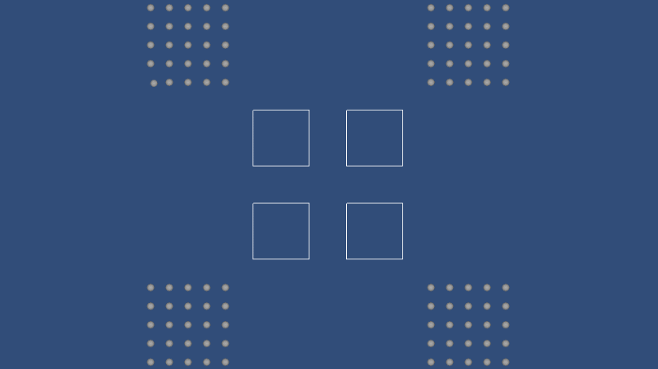
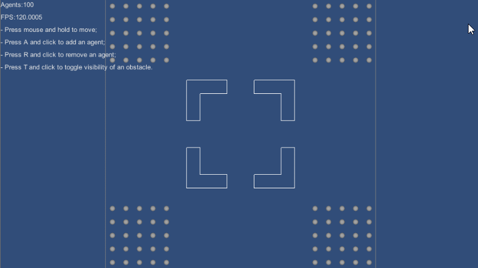

Based on [https://github.com/snape/RVO2-CS]

With some modifications:

1. Unity JobSystem integration

2. Runtime agent and obstacle add/remove support

3. Some API modifications

4. Multi simulator instances support

5. New samples

---

Sceen records for samples:

- Block

- Circle

- Interactive

- Dynamic

